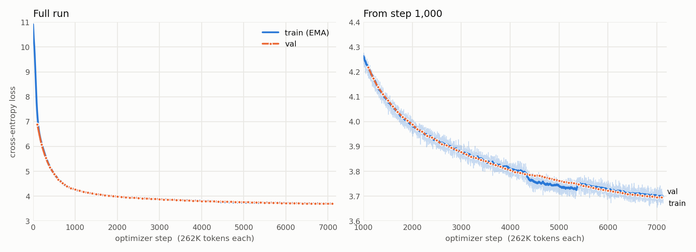

# GPT2_FromScratch

A from-scratch GPT-2 implementation in PyTorch Lightning, trained on [FineWeb-Edu](https://huggingface.co/datasets/HuggingFaceFW/fineweb-edu) on a single free Google Colab T4 GPU, and evaluated on HellaSwag.

The model and training recipe follow Andrej Karpathy's [Let's reproduce GPT-2 (124M)](https://www.youtube.com/watch?v=l8pRSuU81PU). His original training run used 8 A100 GPUs, so this project trains a **smaller model on a fraction of the data** to see how much it can learn on free hardware. Step-by-step reimplementations of the Karpathy lectures are in [`karpathy_nanogpt/`](karpathy_nanogpt/).

## What was trained

| | Karpathy's GPT-2 (124M) | This run |
|---|---|---|
| Layers / heads / embedding dim | 12 / 12 / 768 | 6 / 6 / 384 |
| Context length | 1024 | 256 |
| Parameters | 124M | 30.1M (19.3M of it is the token embedding, shared with the output layer) |
| Data | FineWeb-Edu, 10B tokens | First 2B tokens of FineWeb-Edu (20 of the 99 pre-tokenized shards) |
| Tokens trained on | ~10B | 1.78B in the evaluated checkpoint (step 6,800) |
| Batch size | 524,288 tokens | 262,144 tokens (32 sequences × 256 tokens × 32 gradient-accumulation steps) |
| Precision | bf16 | fp16 mixed precision (the T4 has no bf16) |
| Hardware | 8× A100 | 1× T4 (free Colab), ~51.6K tokens/sec, ~10.4 hours over 2 sessions |

Both use the same recipe: AdamW (β = 0.9, 0.95, weight decay 0.1), gradient clipping at 1.0, linear warmup then cosine decay, `torch.compile`, and the GPT-2 tokenizer. This run's learning rate warms up over 300 steps to 1e-3, then decays to 1e-4 over a planned 7,629 steps, which is one pass over the 2B tokens. Training stopped at step 7,127 when the compute budget ran out. The last checkpoint saved before that was at step 6,800, which is the one evaluated below.

## Results

### Loss curves

<picture>
  <source media="(prefers-color-scheme: dark)" srcset="figures/loss_curves_dark.png">
  
</picture>

| Step | Tokens | Val loss |
|---|---|---|
| 3,300 (end of session 1) | 0.87B | 3.854 |
| 6,800 (evaluated checkpoint) | 1.78B | 3.700 |
| 7,100 (last logged) | 1.86B | 3.695 |

Train and val loss track each other closely through the whole run, because the model sees almost every training token only once, so there is no overfitting.

**Note on the dip in train loss between steps 4,330 and 5,359:** training ran in two Colab sessions, and the second session resumed from the step-3,300 checkpoint. A bug in the resume logic, since fixed, made Lightning end the epoch early at step 4,329. Steps 4,330–5,359 then retrained on the same data as steps 3,300–4,329. The model had seen that text about 1,000 steps earlier, which is why train loss dips below val loss in that window while val loss is unaffected. About 0.27B of the 1.78B tokens in the evaluated checkpoint are repeats, so it saw about 1.51B unique tokens.

### HellaSwag

[HellaSwag](https://arxiv.org/abs/1905.07830) is a 4-way multiple-choice test of common-sense sentence completion. Each of the 10,042 validation examples gives a context and 4 possible endings. The model picks the ending it assigns the lowest loss, so it never generates text. `acc_norm` divides that loss by the ending's length so short endings aren't favored; it's the number Karpathy reports.

| Model | Tokens | `acc` | `acc_norm` |
|---|---|---|---|
| Random guessing | – | 25.0% | 25.0% |
| This run, step 3,300 | 0.87B | 26.4% | 26.1% |
| This run, step 6,800 | 1.78B | 26.5% | **26.3%** |
| OpenAI GPT-2 (124M), for reference | ~100B | – | ~29.5% |

Both checkpoints score about 1.3 points above chance, which is about 3 times the ±0.44% standard error on 10,042 examples, so the model has learned a small amount of common sense. The difference between the two checkpoints (+0.3 points) is within that error. HellaSwag improves slowly for small models, and most of the second half of training shows up in the loss rather than in this benchmark.

### Samples

From the step-6,800 checkpoint, prompted with `"Hello, I'm a language model,"` (top-k 50 sampling, 64 tokens):

> Hello, I'm a language model, so I could give a nice and detailed look at how we're doing in class and with us on one page. It really is amazing to think of it as a system and so that I used to show each of the other students in class that there was a different set of objects

> Hello, I'm a language model, but I'm actually working on a set of data types. A set of a set is basically a set of data types and each of them is created an identifier. A set of data types is declared as "fda" in the system and when the network is updated it must

The text is fluent and grammatical, and it stays on the educational topics typical of FineWeb-Edu, but it loses coherence after a sentence or two.

## Repository layout

```
dataset/
  prepare_data.py        download pre-tokenized FineWeb-Edu shards (default: 20 train shards + 1 val shard)
  prepare_hellaswag.py   download the HellaSwag validation set
GPT2_FromScratch/
  model.py               GPT-2 model (causal self-attention, MLP, tied embeddings)
  custom_dataset.py      memory-mapped dataset over the token shards
  pyL_modules.py         Lightning DataModule and model (optimizer, LR schedule, logging, sampling)
  train.py               training entry point, with --resume for continuing from last.ckpt
  predict.py             generate text samples from checkpoints
  eval.py                HellaSwag accuracy for checkpoints
  configs/               config_training_small.yaml (this run), config_training_GPT2.yaml (124M)
  utils/utils.py         resumable random sampler
karpathy_nanogpt/        lecture reimplementations (Tiny Shakespeare GPT, GPT-2 reproduction)
```

## Running it

Set up an environment with Python 3.11:

```bash
uv venv --python 3.11 && source .venv/bin/activate
uv pip install -r requirements.txt
```

Commands are run from the repo root. Data and model paths are set in `GPT2_FromScratch/configs/config_training_small.yaml`; the committed values point at Colab's `/content/` directory, and the local alternatives are commented out next to them.

```bash
python dataset/prepare_data.py                    # ~4.2GB of token shards
python GPT2_FromScratch/train.py                  # needs a wandb login unless use_wandb is False
python GPT2_FromScratch/train.py --resume --resume_id <wandb_run_id>   # continue from last.ckpt

python dataset/prepare_hellaswag.py
python GPT2_FromScratch/predict.py <ckpt> [<ckpt> ...]
python GPT2_FromScratch/eval.py <ckpt> [<ckpt> ...]
```

On Colab, select a T4 runtime, clone the repo, install `requirements.txt` into a venv, download the shards to `/content/finewebedu`, and run `train.py`. `/content` is wiped when a session ends, so keep a copy of `last.ckpt` if you plan to resume in a new session.
